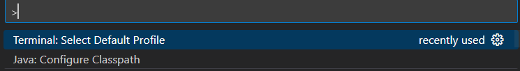
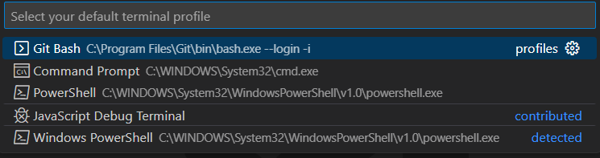
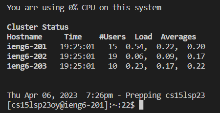
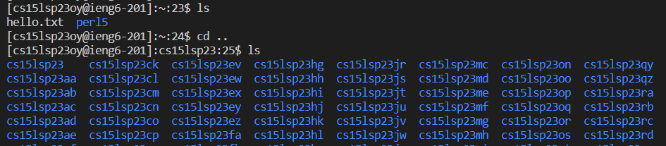
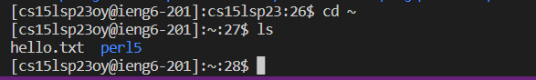

# Lab 1

**Huaming Wu**

---

## How to log into a course-specific account on **ieng6**

1. Make sure that you have both Visual Studio Code https://code.visualstudio.com/ and Git https://git-scm.com/book/en/v2/Getting-Started-Installing-Git Installed

Double check to make sure that you have the correct versions for your device. 

2. When you are on VSC, click CTRL-SHIFT-P on your keyboard

3. Select Default Profile and choose Git Bash

4. This should create a new bash command line in VSC

5. Type in ssh [Insert your cse15l account here]@ieng6.ucsd.edu. Next, you should login with the password that you made when you reset your account.

You should have something like this display:

6. Here are some commands to try. cd .. will go back one directory. ls will show you the contents in the current directory. cd ~ will take you to your home directory.

