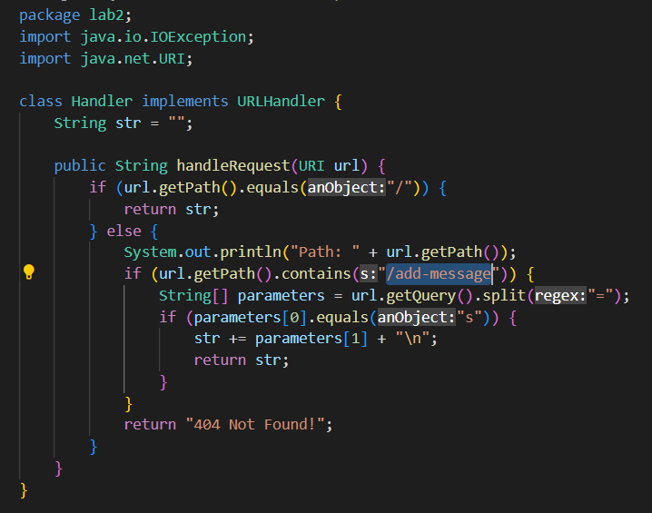
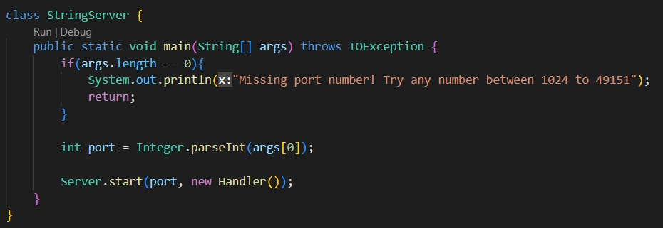
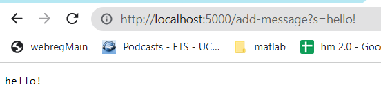
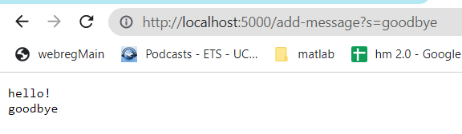
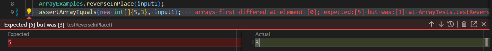
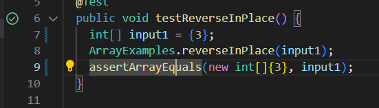

# StringServer
**Huaming Wu**
**A17526592**

## Part 1

Code:




1. **Adding hello!**
: The handleRequest method is called. It checks if the path from URI url contains "/add-message" and then checks the query to know what message to add to str. str is updated when handling this request. The first parameter for url is whether or not it equals s. If so, the method will concatenate the message from the second parameter and return the str. In this case, str is changed to hello!.



2. **Adding goodbye**
: The handleRequest method is also called. It checks if the path from URI url contains "/add-message" and then checks the query to know what message to add to str. str is updated when handling this request. The first parameter for url is whether or not it equals s. If so, the method will concatenate the message from the second parameter and return the str. In this case, str is changed to 

hello!

goodbye



If a port number is not given as the second parameter for java StringSerrver, it will print out an error message.
There is also a Server.start() method that starts the server using the start method from Server.java

## Part 2

**Example code**

```
static int[] reversed(int[] arr) {
    int[] newArray = new int[arr.length];
    for(int i = 0; i < arr.length; i += 1) {
      arr[i] = newArray[arr.length - i - 1];
    }
    return arr;
  }
```

**Error Test**

```
@Test 
public void testReverseInPlace() {
   int[] input1 = {3, 5};
   ArrayExamples.reverseInPlace(input1);
   assertArrayEquals(new int[]{5, 3}, input1);
}
```

**Non-Error Test**

```
@Test 
	public void testReverseInPlace() {
    int[] input1 = {3};
    ArrayExamples.reverseInPlace(input1);
    assertArrayEquals(new int[]{3}, input1);
}
```
**Outputs**

Failure



No Failure


